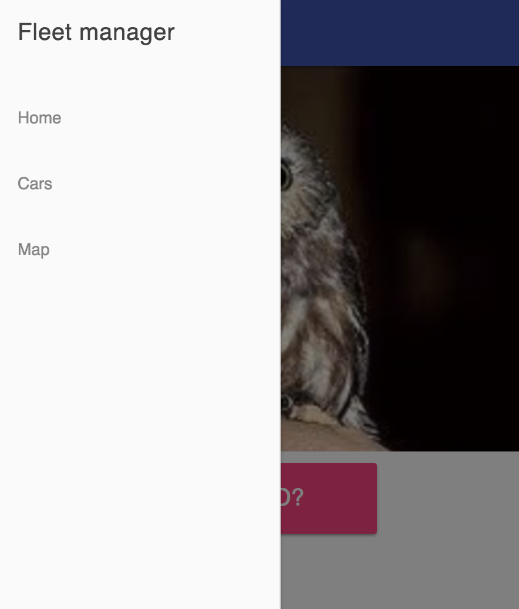
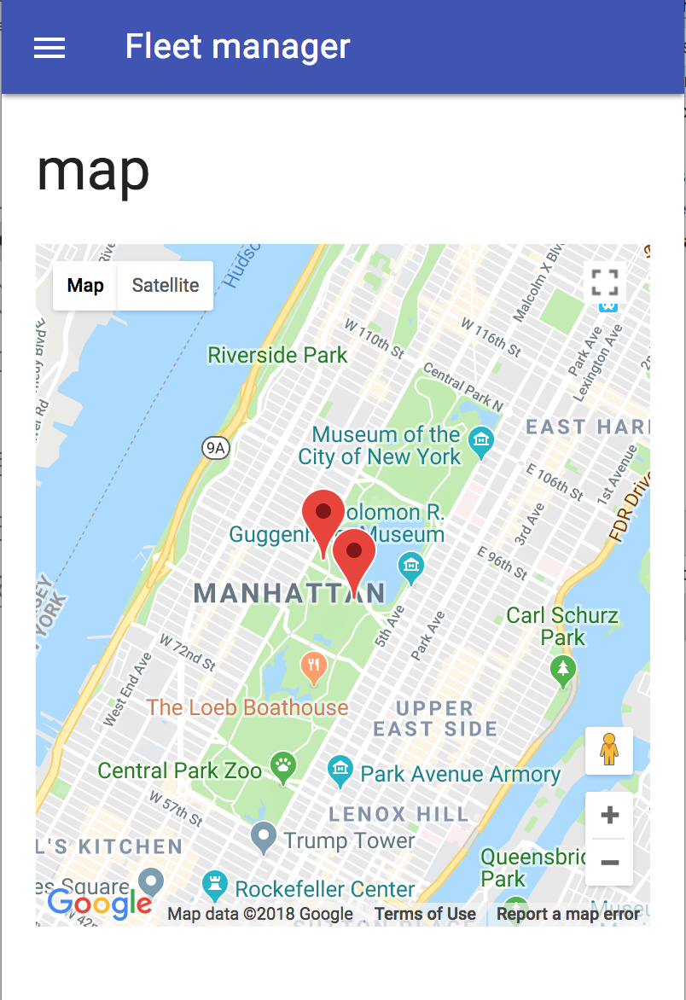
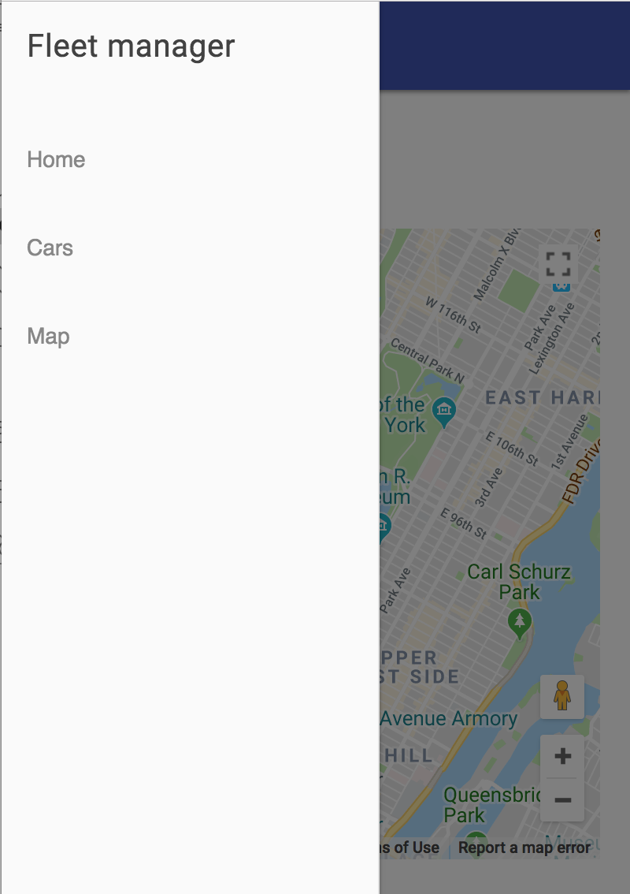

# pluralsight-js-es6-oop-course
https://app.pluralsight.com/library/courses/javascript-es6-object-oriented-programming/table-of-contents

Run:

npm run dev

Dependencies:

npm i --save es6-module-loader traceur // @0.0.111

npm i -save material-design-lite //@1.3.0
npm i -save jquery // @3.3.1
npm i -save systemjs@0.19.27  <-- version must

Screenshots:

 

